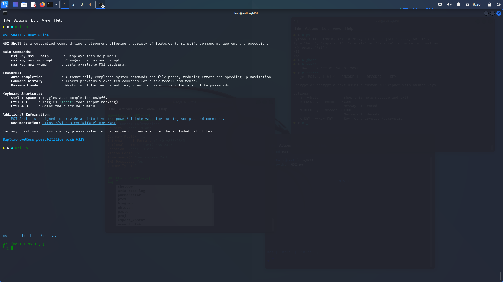
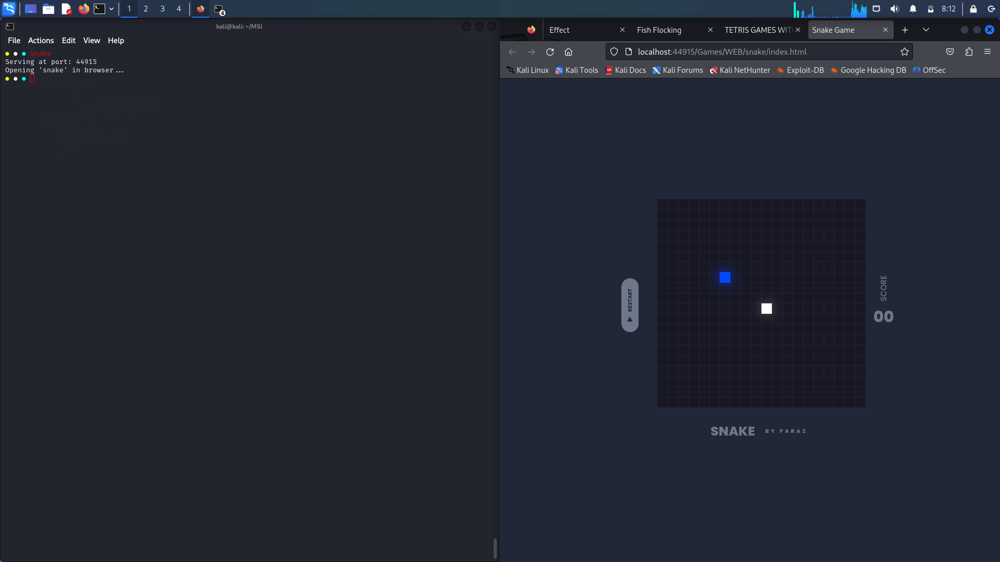
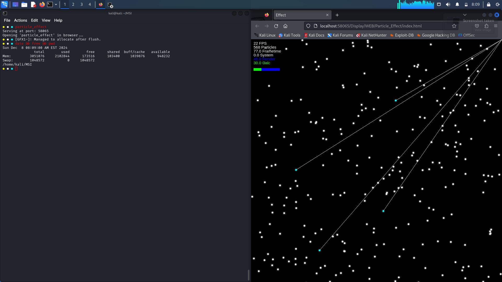
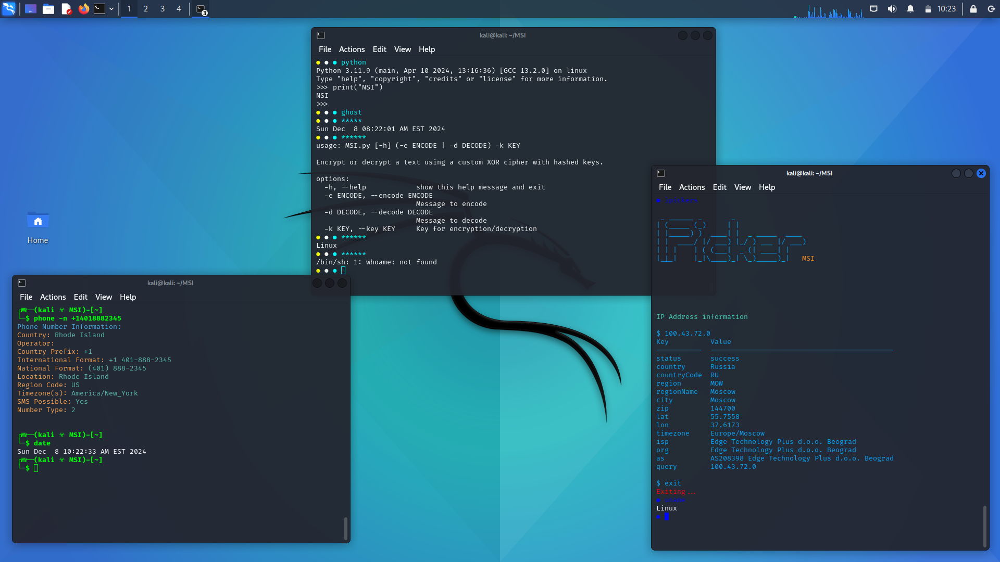
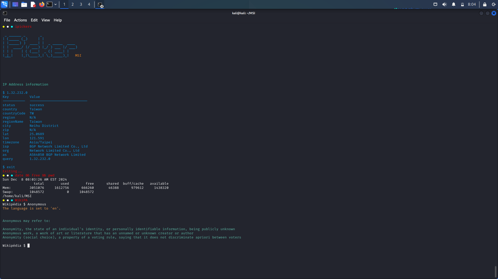
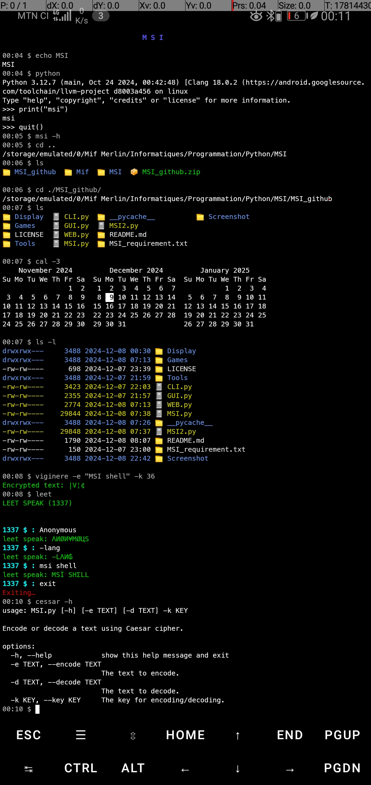
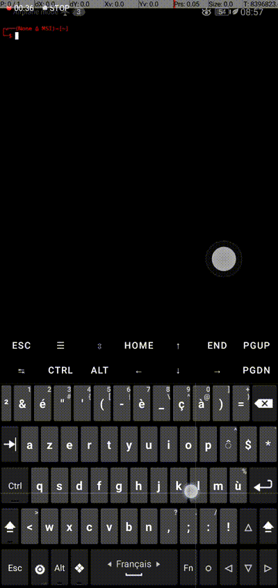

# MSI

**Description:**  
MSI is a powerful and versatile cross-platform interactive shell designed to streamline and centralize the management of CLI, GUI, and WEB tools. It goes beyond basic shell functionalities by providing advanced features such as intelligent auto-completion, asynchronous command execution, and extensive customization options. MSI enables users to seamlessly execute complex workflows, automate repetitive tasks, and integrate various tools and scripts across diverse interfaces. Whether you are managing system commands, launching graphical applications, or interacting with web services, MSI offers a unified and efficient environment tailored to your needs.

**Note:** This is not the complete program. Several additional tools are integrated into this shell but are not included in the version currently available on GitHub.  

## Main Modules:
- `MSI.py` : The main entry point of the project. This file contains the core functionalities for running the project.

## Contributing:
We are looking for contributors to enrich MSI by adding new tools and features to the shell. Whether you're an experienced developer or a beginner, your contributions are crucial for advancing this project! Feel free to **fork** the repository, create a branch for your modifications, and submit a **pull request**. Together, we will make MSI even more powerful and versatile, transforming it into a comprehensive platform for executing commands, automating tasks, and seamlessly integrating various tools. Every idea and effort will contribute to the growth and improvement of this collaborative project.


## Installation:
1. Clone the repository:
   ```bash
   git clone https://github.com/MifMerlin369/MSI.git
   cd MSI
   pip install -r MSI_requirement.txt
   python MSI.py


## Demonstrations

Screenshots of MSI in action:


*msi help command.*


*Showcasing how MSI interacts with web programs..*

*Showcasing how MSI interacts with web programs..*


*Usage of Commands.*

*Usage of Commands.*


*Running MSI on Termux..*

*Running MSI on Termux..*


